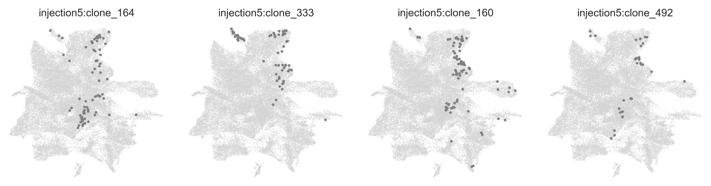
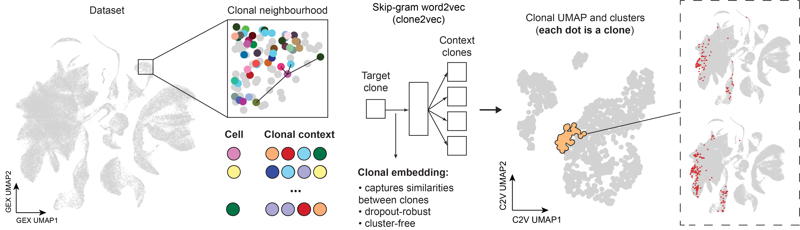
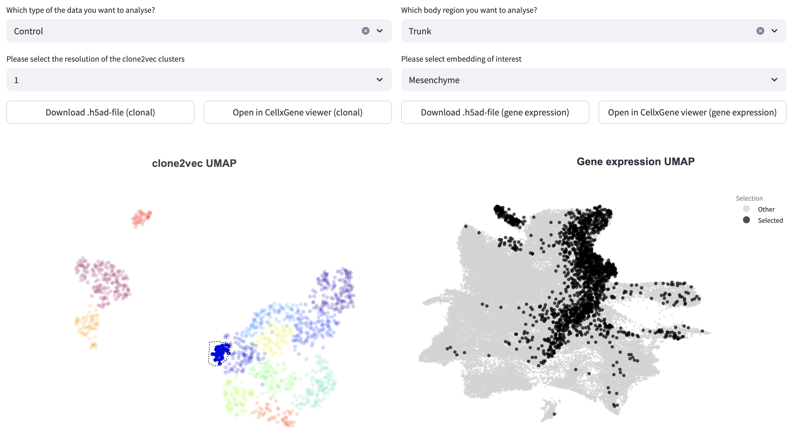

Intuitions behind clone2vec
===========================

The importance of clonal biology
--------------------------------
A **clone** is a group of cells that all come from a single ancestor cell at some point of development. Stem and progenitor cells 
divide and give rise to different specialized cell types. By studying clones, we can trace how individual cells contribute 
to tissues and organs, helping us understand which cells give rise to which structures and how different cell types emerge 
from the same starting population.

Cells that seem identical at first glance can have very different fates. Even within one 
tissue, different clones generate a mix of different cell types, revealing hidden functional diversity among cell populations. 
By analyzing clones in detail, we can better understand development, disease, and how tissues regenerate.

clone2vec: learning clonal contexts from barcoded scRNAseq data
---------------------------------------------------------------
When analyzing barcoded single-cell transcriptomics data, you notice many clones that have the same combinations of cell types 
or occupy similar transcriptional niches.

This happens because a cell's lineage history has a big influence on its gene expression  state (even within a single cell type).
These similar-behaving clones are likely to arise from similar (and intuitively, we find, 
spatially nearby) progenitor cells. We were interested in categorizing these clone types in an unbiased way, so we developed **clone2vec**, 
which learns the "clonal context" of cells directly from transcriptional neighborhoods (without using cell type annotations).

Our method is inspired by **word2vec**, a machine learning model used in language processing. In word2vec, each word is represented as 
a point in a multi-dimensional space based on its context. Words that appear together in similar contexts have similar meanings. 
For example, in a language model, "king" and "queen" are close to each other in meaning, just like "apple" and "banana" might be.

Clone2vec works the same way, but instead of words we use clonal identities of cells. Just like word2vec learns relationships between 
words based on the company they keep, clone2vec learns relationships between clones based on the neighborhoods their cells occupy in gene 
expression space. If two clones consistently appear in similar transcriptional neighborhoods, the model will learn to place them close 
together in the clonal embedding space.

By mapping clones in this way, we can uncover relationships between cell types, predict how clones are functionally related, and explore 
how different cell lineages contribute to development. Our interactive application **clones2cells** makes this analysis interactive, 
allowing users to explore these complex patterns with simple visualizations.

Advantages of clone2vec for analyzing cell lineages
---------------------------------------------------
Clone2vec embeds clonal data into a vector space, allowing continuous analysis of cellular behaviors. 
Unlike conventional methods, which often rely on binary fate assignments, clone2vec indirectly quantifies and compares the proportions of different 
cell types within clones, thereby capturing subtle variations in cell fate biases. Instead of cell types, the algorithm uses transcriptional 
neighbourhoods, therefore it's becoming more dropout-robust as soon as even within the single cell type clones with similar behaviour usually 
share similar transcriptional signatures.

Clonal embeddings can be applied to address several critical research questions. Researchers can explore how positional signals influence 
cell fate decisions by mapping clone behaviors across spatial contexts (by leveraging known patterning 
systems such as the Hox code). Additionally, integration of multiple time points of injection allows the identification 
of specific developmental periods when cell fate decisions become restricted or flexible. Third, clone2vec also aids in elucidating molecular 
pathways and signaling networks that drive clonal expansion and influence lineage biases, thereby identifying both primary and auxiliary 
regulatory mechanisms that modulate developmental outcomes.

This scalable framework offered by clone2vec can be adapted to other tissue systems in embryonic development, immunology, stem cell 
research, cancer studies, and tissue regeneration.

Exploring the clonal atlas via clonal and transcriptional embeddings with clones2cells
--------------------------------------------------------------------------------------
The **clones2cells** viewer allows users to explore clonal relationships and gene expression patterns in an interactive way. 
The app visualizes how different clones relate to each other and how they map onto transcriptional space.

On the left side (clone2vec UMAP), we show a clonal embedding, in which each dot is a clone. Clonal embeddings display the clones 
positioned relative to each other in a learned space. Clones that appear close together likely share similar fate potentials or arise 
from related progenitors. Users can click on an individual clone or select multiple clones using the lasso tool to visualize cells from
the clone(s) on the right side (gene expression UMAP).

An example of clones2cells application can be found for the `Erickson, Isaev, et al. dataset <https://clones2cells.streamlit.app>`.